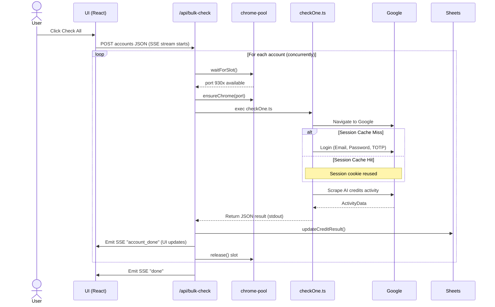

# Bulk Check — Full Sequence Diagram

> **File:** `BULK_CHECK_FLOW.md`  
> **Covers:** Every step, branch, error path, and sub-flow for the bulk account credit check.  
> **Source files:** `BulkCheckModal.tsx` → `POST /api/bulk-check` → `chrome-pool.ts` → `checkOne.ts` → `google-auth.ts` → `sheets.ts`

---

## Overview

```text
BulkCheckModal (UI)
    │
    │  POST /api/bulk-check  { accounts[] }
    ▼
/api/bulk-check  (Next.js SSE stream)
    │
    │  for each account (up to CONCURRENCY=10 in parallel):
    │      waitForSlot()  →  ensureChrome(port)  →  exec checkOne.ts
    │                                                       │
    │                                                  google-auth.ts
    │                                                       │
    │                                               Google Accounts / One
    │
    │  updateCreditResult()  →  Google Sheets
    │
    ▼
SSE events  →  BulkCheckModal  (live table update)
```

---

## Concise Sequence Diagram (Happy Path)

This diagram highlights the primary successful flow and key components, omitting error handling and granular retries for readability.



---

## Full Sequence Diagram

```mermaid
sequenceDiagram
    autonumber

    %% ─── Participants ───────────────────────────────────────────────
    actor User
    participant UI    as BulkCheckModal (React)
    participant API   as /api/bulk-check (Next.js)
    participant Pool  as chrome-pool.ts (Pool)
    participant FS    as Filesystem /tmp/
    participant CHR   as Chrome CDP 930x
    participant PW    as checkOne.ts (Subprocess)
    participant AUTH  as google-auth.ts
    participant TOTP  as otplib
    participant GAC   as Google AccountChooser
    participant GLOG  as Google Login
    participant GONE  as Google One
    participant SH    as sheets.ts (API)

    %% ═══════════════════════════════════════════════════════════════
    %% STEP 1 — User triggers bulk check from the UI
    %% ═══════════════════════════════════════════════════════════════
    User->>UI: Click Check All button
    UI->>UI: Set all accounts to status queued
    UI->>UI: startBulk called via useEffect
    UI->>UI: setRunning true, setSummary null

    UI->>API: POST /api/bulk-check with accounts JSON

    %% ═══════════════════════════════════════════════════════════════
    %% STEP 2 — API validates and opens SSE stream
    %% ═══════════════════════════════════════════════════════════════
    API->>API: Parse request body to accounts array
    alt accounts array is empty or missing
        API-->>UI: 400 error No accounts
        UI->>UI: catch error, setRunning false
    else accounts valid
        API-->>UI: 200 OK with text/event-stream
        note over UI: ReadableStream reader opened, decode loop begins

        API->>API: Emit SSE type start, total N, concurrency CONCURRENCY
        
        API->>API: completed = 0, errors = 0
        API->>API: Promise.all mapping accounts
        note over API: All N tasks fire concurrently. Each blocks on waitForSlot() until a Chrome slot is free.
    end

    %% ═══════════════════════════════════════════════════════════════
    %% STEP 3 — Per-account task (runs up to CONCURRENCY in parallel)
    %% ═══════════════════════════════════════════════════════════════

    loop For EACH account concurrent gated by pool

        %% ── 3a. Claim a Chrome slot ──────────────────────────────
        API->>Pool: waitForSlot()
        Pool->>Pool: poll slotAvailable map every 200ms
        note over Pool: slotAvailable map contains ports 9300 to 9309

        alt A free slot exists
            Pool->>Pool: Mark port 930x as BUSY
            Pool-->>API: return port 930x and release function
        else All slots busy
            Pool->>Pool: setTimeout poll 200ms retry
            note over Pool: Blocks here until a previous account calls release() in its finally block
            Pool-->>API: return port and release function when free
        end

        API->>API: Emit SSE type account_start rowIndex email port 930x
        UI->>UI: updateState rowIndex to status running
        UI->>UI: Row shows spinner

        %% ── 3b. Ensure Chrome is running on this slot port ─────
        API->>Pool: ensureChrome port 930x
        Pool->>CHR: GET http://localhost:930x/json/version timeout 1500ms

        alt Chrome already running on port 930x
            CHR-->>Pool: 200 OK
            Pool-->>API: returns no-op
            note over Pool,CHR: Chrome was already started by a previous run
        else Chrome not running
            Pool->>FS: Resolve profile dir /tmp/ggchecks-profiles/slot-930x
            Pool->>CHR: spawn Chrome with user-data-dir and debugging-port flags
            Pool->>CHR: child.unref Chrome runs independently

            loop Poll every 500ms max 30 attempts
                Pool->>CHR: GET /json/version timeout 1000ms
                alt Chrome ready
                    CHR-->>Pool: 200 OK
                    Pool->>Pool: break loop
                else Still starting
                    Pool->>Pool: await sleep 500ms retry
                end
            end

            alt Chrome started within 15s
                Pool-->>API: returns success
            else Timeout
                Pool-->>API: throw Error Chrome did not start
                API->>API: catch error block executes
                API->>API: Emit SSE account_error Chrome timeout
                API->>SH: updateCreditResult rowIndex status error
                API->>API: errors++
                API->>Pool: release slot
                note over API: Skip to next account
            end
        end

        API->>API: Emit SSE type chrome_ready port 930x
        UI->>UI: setChromePort 930x shows green badge

        %% ── 3c. Spawn checkOne.ts subprocess ─────────────────────
        API->>API: set env ACCOUNT_JSON
        API->>API: exec npx tsx checkOne.ts with 120s timeout
        note over API: stdout buffered in memory, stderr discarded in bulk mode

        %% ── 3d. checkOne.ts boots up ──────────────────────────────
        note over PW: checkOne.ts starts in a new Node.js process. Reads credentials from env.

        PW->>PW: Parse credentials
        PW->>AUTH: createBrowserCDP on port 930x
        AUTH->>CHR: chromium.connectOverCDP
        CHR-->>AUTH: Browser object CDP connection
        AUTH->>CHR: get existing default context and page
        AUTH-->>PW: return browser context page

        note over PW,CHR: CDP mode controls the EXISTING Chrome profile with all its cookies. browser.close() later will only DISCONNECT, not kill Chrome.

        %% ── 3e. Navigate to AccountChooser ────────────────────────
        PW->>PW: Build accounts.google.com/AccountChooser URL
        PW->>GAC: page.goto AccountChooser timeout 60s
        GAC-->>PW: HTTP response
        PW->>PW: await sleep 1500ms

        %% ── 3f. Session cache decision ────────────────────────────
        PW->>PW: Check page.url

        alt URL does NOT include accounts.google.com
            note over PW,GONE: Google redirected straight to one.google.com because this Chrome profile has a valid session cookie.
            PW->>PW: log Session cache hit skipping login
            note over PW: No login steps needed. Go straight to scraping.

        else URL includes accounts.google.com
            note over PW,GLOG: First run, expired session, or different account on this slot requires full login.

            %% ── 3g. Full Google Login flow ────────────────────────
            PW->>AUTH: googleLogin
            AUTH->>AUTH: log Logging in

            AUTH->>GLOG: waitForSelector email input
            GLOG-->>AUTH: Email input visible

            AUTH->>GLOG: fill email input
            AUTH->>GLOG: keyboard press Enter

            AUTH->>GLOG: waitForSelector password input
            GLOG-->>AUTH: Password input visible

            AUTH->>AUTH: sleep 500ms delay
            AUTH->>GLOG: fill password input
            AUTH->>GLOG: keyboard press Enter
            AUTH->>AUTH: sleep 2500ms wait for process

            %% ── 3h. TOTP detection ────────────────────────────────
            AUTH->>GLOG: page.url and document.body.innerText

            AUTH->>AUTH: isTotpPrompt check URL and body string

            alt TOTP challenge detected
                AUTH->>AUTH: log TOTP prompt detected
                AUTH->>AUTH: call fillAndSubmitTOTP

                loop Up to 10 attempts max 5 seconds
                    AUTH->>GLOG: try find totp input elements
                    alt Input found and visible
                        GLOG-->>AUTH: element handle
                        AUTH->>AUTH: break loop
                    else Not found yet
                        AUTH->>AUTH: sleep 500ms retry
                    end
                end

                alt Input NOT found
                    AUTH-->>PW: throw Error TOTP input not found
                    PW-->>API: process exits with error
                end

                AUTH->>TOTP: generateSync
                note over TOTP: otplib generates 6-digit TOTP
                TOTP-->>AUTH: Return 6-digit code
                AUTH->>AUTH: log Code generated

                AUTH->>GLOG: fill input with 6-digit code
                AUTH->>AUTH: sleep 300ms
                AUTH->>GLOG: keyboard press Enter

                AUTH->>GLOG: waitForURL not accounts.google.com timeout 15000ms
                alt Redirect detected
                    GLOG-->>AUTH: URL changed
                else Timeout
                    AUTH->>AUTH: fall back sleep 3000ms
                end

                AUTH->>AUTH: sleep 1000ms post-TOTP stabilization

            else No TOTP required
                AUTH->>GLOG: waitForURL not accounts.google.com
                alt Redirect detected
                    GLOG-->>AUTH: URL changed
                else Timeout
                    AUTH->>AUTH: ignore and continue
                end
            end

            %% ── 3i. Passkey prompt dismissal ──────────────────────
            AUTH->>AUTH: dismissPasskeyPrompt
            AUTH->>GLOG: check document.body.innerText for passkey keywords

            alt Body contains simplify your sign-in or passkey
                AUTH->>AUTH: log Passkey prompt detected
                AUTH->>GLOG: page.evaluate find and click Not now button
                alt Not now button found
                    AUTH->>AUTH: log Passkey prompt dismissed
                    AUTH->>AUTH: sleep 1500ms
                    AUTH->>GLOG: waitForURL not accounts.google.com
                end
            else No passkey prompt
                note over AUTH: No action needed
            end

            %% ── 3j. Final login assertion ─────────────────────────
            AUTH->>PW: get finalUrl
            alt finalUrl includes accounts.google.com
                AUTH-->>PW: throw Error Login did not complete
                PW->>PW: catch block
                PW->>PW: stdout write error JSON
                note over PW: subprocess exits
            else Login complete
                AUTH->>AUTH: log Login successful
                AUTH-->>PW: returns

                %% ── 3k. Navigate to activity page after login ─────
                PW->>GONE: page.goto ACTIVITY_URL timeout 60s
                GONE-->>PW: page loaded
                PW->>PW: sleep 2000ms
            end
        end

        %% ── 3l. Scrape the activity page ──────────────────────────
        PW->>GONE: waitForFunction body includes AI credits activity timeout 60s
        note over GONE: Waits for the React content to render

        alt AI credits activity appears
            GONE-->>PW: function resolved
        else Timeout
            PW->>PW: catch soft fail attempt scrape anyway
        end

        PW->>PW: sleep 1500ms stabilization

        PW->>GONE: page.evaluate scrape logic
        note over PW,GONE: Inline IIFE string extracts monthly credits, additional credits, expiry date, and family member activities.

        GONE-->>PW: ActivityData object

        %% ── 3m. Build result and emit ─────────────────────────────
        PW->>PW: Assemble CheckResult object
        PW->>PW: process.stdout.write JSON payload with newline
        PW->>PW: log completion to stderr

        %% ── 3n. Cleanup disconnect Playwright from Chrome ───────
        PW->>CHR: browser.close()
        note over PW,CHR: CDP disconnect ONLY. Chrome process stays alive. Profile dir and session cookies PERSIST. Next run on this slot gets cache hit.
        PW->>PW: process exits code 0

        %% ── 3o. API receives subprocess result ────────────────────
        API->>API: exec callback fires parses stdout
        
        alt result.success is true
            API->>API: Build memberText string
            API->>SH: updateCreditResult sheet push

            alt Sheets write succeeds
                SH-->>API: void success
            else Sheets write fails
                SH-->>API: throws Error
                API->>API: catch error swallowed
                note over API: Result is still sent to UI even if Sheets fails
            end

            API->>API: Emit SSE type account_done with credit result
            UI->>UI: updateState status done with credit values
            UI->>UI: Row shows checkmark and credit numbers
            API->>API: completed++

        else result.success is false
            API->>SH: updateCreditResult sheet with error status
            SH-->>API: saved or swallowed

            API->>API: Emit SSE type account_error with error msg
            UI->>UI: updateState status error
            UI->>UI: Row shows error badge
            API->>API: errors++
        end

        %% ── 3p. Handle subprocess crash or parse failure ───────────
        note over API: Outer catch block catches exec err OR parse fail

        alt stdout empty AND exec returns error
            API->>API: extract err.message
        else stdout is unparseable
            API->>API: grab parse error details
        end

        API->>SH: updateCreditResult sheet with error msg
        SH-->>API: saved or swallowed
        API->>API: Emit SSE type account_error
        UI->>UI: updateState status error
        API->>API: errors++

        %% ── 3q. Always release the slot ───────────────────────────
        API->>Pool: release() executes in finally block
        Pool->>Pool: mark slot available
        note over Pool: Slot is FREE. Next waiting account will pick it up.
    end

    %% ═══════════════════════════════════════════════════════════════
    %% STEP 4 — All accounts finished
    %% ═══════════════════════════════════════════════════════════════
    API->>API: await Promise.all resolves
    API->>API: Emit SSE type done completed N errors M
    API->>API: controller.close closes ReadableStream
    note over API: HTTP response body ends

    %% ═══════════════════════════════════════════════════════════════
    %% STEP 5 — UI finalizes
    %% ═══════════════════════════════════════════════════════════════
    UI->>UI: SSE reader done breaks loop
    UI->>UI: setSummary setDone onDone
    UI->>UI: setRunning false

    UI->>User: Progress bar 100% Summary Shows success and fail counts
    UI->>User: Run Again button and Close button enabled
```



---

## Error Paths Summary

| Error Scenario | Where caught | SSE emitted | Sheets updated | Slot released |
|---|---|---|---|---|
| `accounts` array missing/empty | API route entry | 400 HTTP error (no SSE) | ❌ | N/A |
| Chrome fails to start in 15s | `ensureChrome` throws → API catch | `account_error` | ✅ `error: Chrome timeout` | ✅ finally |
| subprocess timeout (120s) | `exec` callback `err` with empty stdout | `account_error` | ✅ `error: ...` | ✅ finally |
| subprocess crashes (non-zero exit) | `exec` callback `err` | `account_error` | ✅ | ✅ finally |
| `JSON.parse(stdout)` fails | `exec` callback try/catch | `account_error` | ✅ | ✅ finally |
| `result.success === false` | API after parse | `account_error` | ✅ `error: <msg>` | ✅ finally |
| TOTP input not found (10 attempts) | `fillAndSubmitTOTP` throws | `account_error` (via stdout JSON) | ✅ | ✅ finally |
| Login did not complete (still on auth page) | `googleLogin` throws | `account_error` (via stdout JSON) | ✅ | ✅ finally |
| Sheets `updateCreditResult` fails | `.catch(()=>{})` — **swallowed** | ❌ | ❌ silently fails | ✅ (unaffected) |
| SSE stream write fails | try/catch around `enqueue` — **ignored** | — | ✅ (already saved) | ✅ |

---

## Concurrency Timeline Example

Given 5 accounts and `CONCURRENCY=3` (slots: 9300, 9301, 9302):

```text
Time →   0s      5s      10s     15s     20s     25s     30s
         ────────────────────────────────────────────────────
Slot 9300 [Acc1: wait+login+scrape+save]
Slot 9301 [Acc2: login+scrape+save]
Slot 9302 [Acc3: cache hit+scrape+save]
          ↑                           ↑
          All 3 slots claimed         Acc3 finishes first → slot 9302 freed
                                                    [Acc4 starts on 9302]
                               [Acc1 done → 9300 freed]
                                                       [Acc5 starts on 9300]
         ────────────────────────────────────────────────────
Acc4: queued ──────────────────────────► running on 9302 ──► done
Acc5: queued ─────────────────────────────────────────────► running on 9300 ► done
```

---

## Session Cache Behavior

```text
First run (slot 9300, account A@gmail.com):
  AccountChooser → accounts.google.com (login required)
  → Full login: email → password → TOTP
  → Google sets session cookie in Chrome profile /tmp/.../slot-9300/
  → Playwright disconnects, Chrome keeps profile on disk

Second run (same slot, same account):
  AccountChooser → one.google.com/ai/activity  ← REDIRECT (session valid)
  → "Session cache hit — skipping login"
  → Scrape immediately

Different account on same slot:
  AccountChooser → accounts.google.com (session for OTHER email)
  → Full login required
  → Profile now has session for the new account
```

---

## Key Constants

| Constant | Default | Source |
|---|---|---|
| `CONCURRENCY` | `10` | `BULK_CONCURRENCY` env var |
| `BASE_PORT` | `9300` | `BULK_BASE_PORT` env var |
| `PROFILE_DIR` | `/tmp/ggchecks-profiles` | `BULK_PROFILE_DIR` env var |
| `ACTIVITY_URL` | `https://one.google.com/ai/activity?pli=1&g1_landing_page=0` | hardcoded in `checkOne.ts` |
| Subprocess timeout | `120,000 ms` | `exec({ timeout: 120_000 })` |
| Chrome startup timeout | `15,000 ms` | `ensureChrome` — 30 × 500ms |
| TOTP input poll max | `5,000 ms` | `fillAndSubmitTOTP` — 10 × 500ms |
| Page navigation timeout | `60,000 ms` | `TIMEOUT` in `checkOne.ts` |
| Post-password wait | `2,500 ms` | `sleep(2500)` in `googleLogin` |
| Post-TOTP wait | `1,000 ms` | `sleep(1000)` in `googleLogin` |
| Post-passkey dismiss wait | `1,500 ms` | `sleep(1500)` in `dismissPasskeyPrompt` |
| Pre-scrape wait | `1,500 ms` | `sleep(1500)` in `scrapeActivityPage` |
